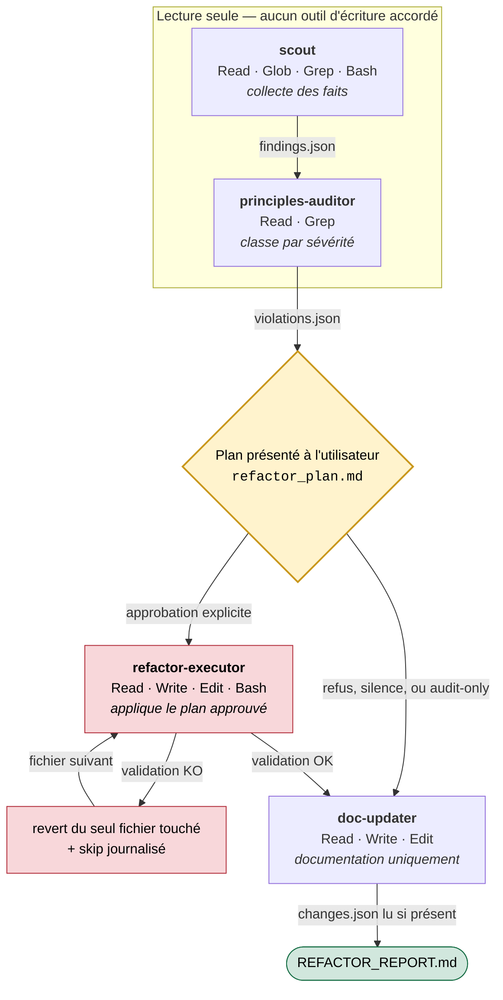

# quality-team

**Une équipe de quatre agents IA spécialisés qui auditent un codebase, proposent un plan de refactoring, puis n'appliquent que les changements que vous avez explicitement approuvés — et les annulent si la validation échoue.**

`quality-team` est une extension [Claude Code](https://claude.com/claude-code) : un skill orchestrateur et quatre sous-agents, distribués sous forme de fichiers Markdown et de schémas JSON. Elle s'adresse aux développeurs qui héritent d'un codebase dont la qualité s'est dégradée — en particulier lorsqu'une part importante du code a été générée par IA.

```text
/quality-team src audit-only
```

---

## Le problème

Demander directement à un LLM « refactore mon code » pose trois problèmes concrets :

| Problème | Conséquence |
|---|---|
| **Le modèle n'a pas de carte du projet.** Il juge des fichiers qu'il lit isolément. | Il supprime du « code mort » en réalité référencé ailleurs. |
| **Rien ne limite l'ampleur des modifications.** Une demande de nettoyage se transforme en réécriture. | La revue devient impossible, le diff illisible. |
| **Aucune vérification n'est faite après coup.** | Les régressions ne sont découvertes qu'en aval. |

À cela s'ajoute un cas devenu courant : le code produit par IA développe ses propres pathologies récurrentes — sur-génération, erreurs silencieusement avalées, doubles sources de vérité, abstractions prématurées — que les linters classiques ne détectent pas, parce que ce ne sont pas des erreurs de syntaxe mais des défauts d'intention.

## L'approche

Le pipeline sépare les responsabilités entre quatre agents et impose une contrainte structurelle : **les agents qui jugent ne peuvent pas écrire, et l'agent qui écrit ne juge pas.**



Aucune flèche ne mène à `refactor-executor` sans passer par le losange : c'est le seul point du pipeline où du code peut commencer à être modifié, et il exige une réponse affirmative.

Quatre décisions structurent l'ensemble :

**1. Les agents communiquent par contrats, pas par conversation.**
Chaque agent lit et écrit des fichiers JSON dont la forme est fixée par un schéma versionné dans `quality-team/schemas/`. Un agent qui produit un artefact malformé fait échouer l'étape suivante de façon visible, au lieu de propager une approximation.

**2. Les permissions sont restreintes agent par agent.**
La lecture seule n'est pas une consigne, c'est une configuration. `scout` et `principles-auditor` ne reçoivent aucun outil d'écriture dans leur frontmatter — il leur est matériellement impossible de modifier un fichier.

| Agent | Outils accordés | Peut modifier le code ? |
|---|---|---|
| `scout` | `Read`, `Glob`, `Grep`, `Bash` | Non |
| `principles-auditor` | `Read`, `Grep` | Non |
| `refactor-executor` | `Read`, `Write`, `Edit`, `MultiEdit`, `Bash` | Oui, dans le périmètre du plan approuvé |
| `doc-updater` | `Read`, `Write`, `Edit` | Non — documentation uniquement |

**3. Aucune modification sans approbation explicite.**
Avant toute écriture, l'orchestrateur produit `refactor_plan.md` — fichier par fichier, avec le problème, le changement prévu, le risque et la commande de validation associée — et attend une réponse affirmative. Toute réponse absente, ambiguë ou négative bascule le run en mode rapport seul.

**4. Chaque changement est validé, et annulé s'il casse quelque chose.**
`refactor-executor` détecte les commandes de validation déclarées par le projet cible (`test`, `lint`, `typecheck`, `build`…), les exécute après chaque fichier modifié, et fait un revert du seul fichier concerné si la validation échoue — en journalisant la raison dans `changes.json`.

## Portée : généraliste par défaut

Le cœur du pipeline ne suppose aucun langage ni framework. La détection se fait au runtime à partir des manifests présents (`package.json`, `Cargo.toml`, `pyproject.toml`, `go.mod`, `pom.xml`, `composer.json`, `Gemfile`, `Makefile`, `.csproj`…) et des extensions de fichiers rencontrées.

Les règles spécialisées vivent dans des **playbooks optionnels**, chargés uniquement si le stack correspondant est détecté. Un playbook non applicable ne peut produire aucune violation.

Le pipeline fonctionne également **sans aucun outillage externe** : si aucune commande de validation n'est détectée, l'audit se poursuit, la validation est marquée `skipped` et le refactoring automatique devient plus conservateur.

## Stack technique

| | |
|---|---|
| **Plateforme** | Claude Code — skills et sous-agents |
| **Format** | Markdown avec frontmatter YAML, JSON Schema (draft `$schema`) |
| **Dépendances d'exécution** | Aucune. Ni runtime, ni build, ni gestionnaire de paquets. |
| **Modèle des sous-agents** | `sonnet` pour les quatre agents |
| **MCP recommandé** | [Qartez](https://github.com/kuberstar/qartez-mcp) — cartographie, hotspots, blast radius, dead code cross-fichiers, clones AST |
| **MCP optionnels** | `@knip/mcp` (JS/TS), SonarQube (enterprise) |
| **CLI optionnelle** | `lizard` pour la complexité multi-langage |

Tous les outils externes sont facultatifs et dégradent proprement en cas d'absence.

## Architecture

```text
skills_refactor/
├── quality-team/                    # Le skill, à installer dans ~/.claude/skills/
│   ├── SKILL.md                     # Orchestrateur : parse les arguments, détecte le
│   │                                #   projet, charge les références, spawne les agents.
│   │                                #   Volontairement léger — ne porte aucune logique d'audit.
│   ├── README.md                    # Documentation d'usage du skill
│   │
│   ├── references/                  # Règles universelles, injectées dans les prompts
│   │   ├── principles.md            #   P1–P10 : responsabilité, source de vérité, contrats,
│   │   │                            #   invariants, erreurs, effets de bord, duplication,
│   │   │                            #   nommage, complexité, documentation
│   │   ├── ai-smells.md             #   27 patterns récurrents du code généré par IA
│   │   ├── safe-refactor.md         #   Ce que l'exécuteur a le droit de faire, en 4 niveaux
│   │   ├── clean-code-rules.md      #   Clean Code / Clean Architecture / Legacy Code
│   │   └── refactoring-rules.md     #   Refactoring (Fowler)
│   │
│   ├── playbooks/                   # Règles spécialisées, chargées sous condition
│   │   ├── react-ts.md              #   State management, IPC Tauri, TypeScript, hooks
│   │   └── rust.md                  #   Gestion d'erreurs, nommage, Clippy, paths
│   │
│   ├── schemas/                     # Le contrat entre agents
│   │   ├── findings.schema.json     #   scout       → principles-auditor
│   │   ├── violations.schema.json   #   auditor     → executor
│   │   └── changes.schema.json      #   executor    → doc-updater
│   │
│   └── templates/
│       ├── refactor-plan.md         # Plan soumis à l'utilisateur avant modification
│       └── audit-report.md          # Format du REFACTOR_REPORT.md final
│
├── agents/                          # Les sous-agents, à installer dans ~/.claude/agents/
│   ├── scout.md                     # Analyse statique. Collecte des faits, pas des jugements.
│   ├── principles-auditor.md        # Audit qualitatif. Classe par sévérité.
│   ├── refactor-executor.md         # Application prudente. Safety gate + revert.
│   └── doc-updater.md               # Rapport final. Ne touche jamais au code source.
│
├── docs/
│   ├── architecture.md              # Contrats JSON et modèle de sécurité en détail
│   └── design-spec.md               # Spécification de conception d'origine
│
├── INSTALL.md                       # Installation Linux, macOS et Windows
└── MCP_CHECKLIST.md                 # Configuration des MCP et CLI optionnels
```

## Installation

Le skill et les agents sont des fichiers à copier dans votre configuration Claude Code. Aucune compilation, aucune dépendance à installer.

**Linux / macOS**

```bash
git clone https://github.com/Skeeder1/skills_refactor.git
cd skills_refactor

mkdir -p ~/.claude/skills ~/.claude/agents
cp -r quality-team ~/.claude/skills/quality-team
cp agents/*.md ~/.claude/agents/
```

**Windows (PowerShell)**

```powershell
git clone https://github.com/Skeeder1/skills_refactor.git
cd skills_refactor

New-Item -ItemType Directory -Force -Path "$env:USERPROFILE\.claude\skills", "$env:USERPROFILE\.claude\agents"
Copy-Item -Recurse -Force ".\quality-team" "$env:USERPROFILE\.claude\skills\quality-team"
Copy-Item ".\agents\*.md" "$env:USERPROFILE\.claude\agents\"
```

**Vérification**

```bash
test -f ~/.claude/skills/quality-team/SKILL.md && echo "skill installé"
ls ~/.claude/agents/
```

La configuration des MCP recommandés est décrite dans [`MCP_CHECKLIST.md`](MCP_CHECKLIST.md). Elle est facultative.

## Utilisation

Depuis la racine du projet à analyser, dans Claude Code :

```text
/quality-team [scope] [mode]
```

| Argument | Valeurs | Défaut |
|---|---|---|
| `scope` | chemin relatif à analyser | `.` |
| `mode` | `audit-only` · `refactor` · `all` | `all` |

```text
/quality-team .                      # audit complet du projet, plan proposé à la fin
/quality-team src audit-only         # rapport seul — aucune écriture possible
/quality-team packages/api refactor  # audit puis refactoring, après approbation du plan
```

### Exemple de déroulé

```text
> /quality-team src audit-only

Phase 0  Détection            package.json, tsconfig.json → TypeScript, React
                              Validations détectées : npm test, npm run lint, npm run typecheck
                              Baseline : test=pass, lint=pass, typecheck=pass
Phase 0b Références           principles, ai-smells, safe-refactor
                              Playbook chargé : react-ts (React détecté)
Phase 1  scout                → .claude/quality-team/findings.json
                                18 hotspots · 7 symboles morts · 4 clones
Phase 2  principles-auditor   → .claude/quality-team/violations.json
                                3 blocking · 11 important · 9 nit · 6 ai_smells
Phase 2b Plan                 → .claude/quality-team/refactor_plan.md
                                Mode audit-only : plan présenté à titre de recommandation.
Phase 4  doc-updater          → REFACTOR_REPORT.md
```

En mode `refactor` ou `all`, la phase 2b s'interrompt sur une demande d'approbation. Sans réponse affirmative explicite, le run se termine en rapport seul.

### Fichiers produits

Dans le projet analysé :

```text
.claude/quality-team/
  project_profile.json          manifests, langages, playbooks applicables
  validation_commands.json      commandes de validation détectées
  baseline_validation.json      état des validations avant toute modification
  findings.json                 analyse statique consolidée
  violations.json               violations classées par sévérité
  refactor_plan.md              plan soumis à l'utilisateur
  changes.json                  changements appliqués et skippés (absent en audit-only)

REFACTOR_REPORT.md              rapport lisible, à la racine du projet
```

## Choix techniques notables

**Le classement `manual_verify` plutôt que le silence.** Un fichier trop risqué à modifier automatiquement — contexte insuffisant, absence de tests — n'est pas ignoré : il est explicitement placé en `manual_verify`, exclu du refactoring, et remonté dans le rapport avec une recommandation. La règle interdit qu'un fichier soit simultanément en `manual_verify` et candidat automatique.

**Une échelle de risque à quatre niveaux dans `safe-refactor.md`.** Les opérations sont réparties entre *toujours sûres après confirmation outillage* (suppression de code mort confirmé, de logs de debug, de blocs commentés), *sûres avec validation post-modification* (renommage, petite extraction locale), *jamais sans validation humaine séparée* (signature publique, migrations, authentification, configuration de build, nouvelle dépendance) et *jamais touchées* (fichiers générés, lockfiles, `DO NOT EDIT`).

**L'incertitude est classée vers le bas.** La consigne donnée à l'auditeur est explicite : en cas de doute, classer en `suggestion`, jamais en `blocking`. Un audit qui crie au loup n'est pas lu.

**Le cœur généraliste est une contrainte de conception, pas une généralisation a posteriori.** Le pipeline visait initialement React / TypeScript / Tauri. La généralisation a consisté à extraire tout le spécifique dans des playbooks conditionnels, en imposant qu'un playbook non applicable ne puisse produire aucune violation — plutôt qu'à ajouter des branches au cœur.

**L'orchestrateur reste un routeur.** `SKILL.md` ne contient aucune logique d'audit. Il parse les arguments, détecte le contexte, charge les références, spawne les agents et vérifie l'existence des fichiers de sortie. Toute la connaissance métier vit dans `references/` et `playbooks/`, où elle est modifiable sans toucher au flux de contrôle.

## Limites connues

- La qualité de l'analyse dépend de l'outillage disponible dans le projet cible. Sans Qartez ni analyseur cross-fichiers, la détection de code mort reste prudente et volontairement incomplète.
- Les corrections automatiques sont délibérément petites. Le pipeline ne remplace pas un refactoring architectural mené par un humain.
- Les playbooks couvrent aujourd'hui React/TypeScript/Tauri et Rust. Les autres stacks sont traités par les seules règles universelles.

## Crédits

`references/clean-code-rules.md` et `references/refactoring-rules.md` sont dérivés de [ciembor/agent-rules-books](https://github.com/ciembor/agent-rules-books), sous licence MIT. La source est indiquée en en-tête de chaque fichier.
