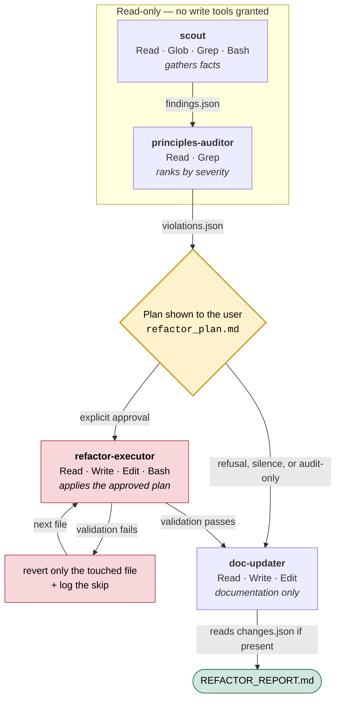

# quality-team

**Four specialised AI agents that audit a codebase, propose a refactoring plan,
then apply only the changes you explicitly approved — and revert any change whose
validation fails.**

`quality-team` is a [Claude Code](https://claude.com/claude-code) extension: one
orchestrator skill and four sub-agents, shipped as Markdown files and JSON
schemas. It is aimed at developers who have inherited a codebase whose quality
has drifted — particularly when a significant share of it was generated by AI.

```text
/quality-team src audit-only
```

---

## The problem

Asking an LLM to "refactor my code" directly has three concrete failure modes:

| Problem | Consequence |
|---|---|
| **The model has no map of the project.** It judges files it reads in isolation. | It deletes "dead code" that is in fact referenced elsewhere. |
| **Nothing bounds the size of the change.** A cleanup request turns into a rewrite. | The diff becomes unreviewable. |
| **No verification happens afterwards.** | Regressions are discovered downstream. |

On top of that sits a case that has become common: AI-generated code develops its
own recurring pathologies — over-generation, silently swallowed errors, duplicate
sources of truth, premature abstraction — that conventional linters do not catch,
because they are not syntax errors. They are defects of intent.

## The approach

The pipeline splits responsibilities across four agents and enforces one
structural constraint: **the agents that judge cannot write, and the agent that
writes does not judge.**



No arrow reaches `refactor-executor` without passing through the diamond: it is
the only point in the pipeline where code can begin to change, and it requires an
affirmative answer.

Four decisions shape the whole design:

**1. Agents communicate through contracts, not conversation.**
Each agent reads and writes JSON files whose shape is fixed by a versioned schema
in `quality-team/schemas/`. An agent that produces a malformed artifact fails the
next step visibly, instead of propagating an approximation.

**2. Permissions are restricted per agent.**
Read-only is a configuration, not an instruction. `scout` and
`principles-auditor` are granted no write tools in their frontmatter — it is
materially impossible for them to modify a file.

| Agent | Tools granted | Can modify code? |
|---|---|---|
| `scout` | `Read`, `Glob`, `Grep`, `Bash` | No |
| `principles-auditor` | `Read`, `Grep` | No |
| `refactor-executor` | `Read`, `Write`, `Edit`, `MultiEdit`, `Bash` | Yes, within the approved plan |
| `doc-updater` | `Read`, `Write`, `Edit` | No — documentation only |

**3. No modification without explicit approval.**
Before any write, the orchestrator produces `refactor_plan.md` — file by file,
with the problem, the intended change, the risk, and the validation command that
covers it — and waits for an affirmative answer. Any missing, ambiguous, or
negative reply switches the run to report-only.

**4. Every change is validated, and reverted if it breaks something.**
`refactor-executor` detects the validation commands the target project declares
(`test`, `lint`, `typecheck`, `build`, …), runs them after each modified file,
and reverts *only that file* if validation fails — logging the reason in
`changes.json`.

## Scope: general-purpose by default

The core of the pipeline assumes no language and no framework. Detection happens
at runtime from whichever manifests are present (`package.json`, `Cargo.toml`,
`pyproject.toml`, `go.mod`, `pom.xml`, `composer.json`, `Gemfile`, `Makefile`,
`.csproj`, …) and from the file extensions encountered.

Specialised rules live in **optional playbooks**, loaded only when the matching
stack is detected. A playbook that does not apply cannot produce a violation.

The pipeline also works **with no external tooling at all**: if no validation
command is detected, the audit proceeds, validation is marked `skipped`, and
automatic refactoring becomes more conservative.

## Tech stack

| | |
|---|---|
| **Platform** | Claude Code — skills and sub-agents |
| **Format** | Markdown with YAML frontmatter, JSON Schema (draft 2020-12) |
| **Runtime dependencies** | None. No runtime, no build step, no package manager. |
| **Sub-agent model** | `sonnet` for all four agents |
| **Recommended MCP** | [Qartez](https://github.com/kuberstar/qartez-mcp) — code mapping, hotspots, blast radius, cross-file dead code, AST clones |
| **Optional MCP** | `@knip/mcp` (JS/TS), SonarQube (enterprise) |
| **Optional CLI** | `lizard`, for multi-language complexity metrics |

Every external tool is optional and degrades gracefully when absent.

## Architecture

```text
skills_refactor/
├── quality-team/                    # The skill, installed into ~/.claude/skills/
│   ├── SKILL.md                     # Orchestrator: parses arguments, detects the
│   │                                #   project, loads references, spawns agents.
│   │                                #   Deliberately thin — carries no audit logic.
│   ├── README.md                    # Usage documentation for the skill
│   │
│   ├── references/                  # Universal rules, injected into the prompts
│   │   ├── principles.md            #   P1–P10: responsibility, source of truth,
│   │   │                            #   contracts, invariants, errors, side effects,
│   │   │                            #   duplication, naming, complexity, documentation
│   │   ├── ai-smells.md             #   27 recurring patterns in AI-generated code
│   │   ├── safe-refactor.md         #   What the executor may do, across 4 risk tiers
│   │   ├── clean-code-rules.md      #   Clean Code / Clean Architecture / Legacy Code
│   │   └── refactoring-rules.md     #   Refactoring (Fowler)
│   │
│   ├── playbooks/                   # Specialised rules, loaded conditionally
│   │   ├── react-ts.md              #   State management, Tauri IPC, TypeScript, hooks
│   │   └── rust.md                  #   Error handling, naming, Clippy, module paths
│   │
│   ├── schemas/                     # The contract between agents
│   │   ├── findings.schema.json     #   scout       → principles-auditor
│   │   ├── violations.schema.json   #   auditor     → executor
│   │   └── changes.schema.json      #   executor    → doc-updater
│   │
│   └── templates/
│       ├── refactor-plan.md         # Plan submitted to the user before any change
│       └── audit-report.md          # Format of the final REFACTOR_REPORT.md
│
├── agents/                          # The sub-agents, installed into ~/.claude/agents/
│   ├── scout.md                     # Static analysis. Collects facts, not judgments.
│   ├── principles-auditor.md        # Qualitative audit. Ranks by severity.
│   ├── refactor-executor.md         # Careful application. Safety gate + revert.
│   └── doc-updater.md               # Final report. Never touches source code.
│
├── docs/
│   ├── architecture.md              # JSON contracts and security model in detail
│   └── design-spec.md               # Original design specification
│
├── INSTALL.md                       # Installation on Linux, macOS and Windows
└── MCP_CHECKLIST.md                 # Configuring the optional MCP servers and CLIs
```

## Installation

The skill and the agents are files you copy into your Claude Code configuration.
Nothing to compile, nothing to install.

**Linux / macOS**

```bash
git clone https://github.com/Skeeder1/skills_refactor.git
cd skills_refactor

mkdir -p ~/.claude/skills ~/.claude/agents
cp -r quality-team ~/.claude/skills/quality-team
cp agents/*.md ~/.claude/agents/
```

**Windows (PowerShell)**

```powershell
git clone https://github.com/Skeeder1/skills_refactor.git
cd skills_refactor

New-Item -ItemType Directory -Force -Path "$env:USERPROFILE\.claude\skills", "$env:USERPROFILE\.claude\agents"
Copy-Item -Recurse -Force ".\quality-team" "$env:USERPROFILE\.claude\skills\quality-team"
Copy-Item ".\agents\*.md" "$env:USERPROFILE\.claude\agents\"
```

**Verify**

```bash
test -f ~/.claude/skills/quality-team/SKILL.md && echo "skill installed"
ls ~/.claude/agents/
```

Expect four files in `~/.claude/agents/`: `scout.md`, `principles-auditor.md`,
`refactor-executor.md`, `doc-updater.md`.

To reinstall over an existing copy on Linux/macOS, delete
`~/.claude/skills/quality-team` first — otherwise `cp -r` nests the directory
inside itself instead of replacing it.

Configuring the recommended MCP servers is described in
[`MCP_CHECKLIST.md`](MCP_CHECKLIST.md) and is optional.

## Usage

From the root of the project you want to analyse, inside Claude Code:

```text
/quality-team [scope] [mode]
```

| Argument | Values | Default |
|---|---|---|
| `scope` | relative path to analyse | `.` |
| `mode` | `audit-only` · `refactor` · `all` | `all` |

```text
/quality-team .                      # full audit, plan proposed at the end
/quality-team src audit-only         # report only — no writes possible
/quality-team packages/api refactor  # audit then refactor, after plan approval
```

### Example run

```text
> /quality-team src audit-only

Phase 0  Detection            package.json, tsconfig.json → TypeScript, React
                              Validations detected: npm test, npm run lint, npm run typecheck
                              Baseline: test=pass, lint=pass, typecheck=pass
Phase 0b References           principles, ai-smells, safe-refactor
                              Playbook loaded: react-ts (React detected)
Phase 1  scout                → .claude/quality-team/findings.json
                                18 hotspots · 7 dead symbols · 4 clones
Phase 2  principles-auditor   → .claude/quality-team/violations.json
                                3 blocking · 11 important · 9 nit · 6 ai_smells
Phase 2b Plan                 → .claude/quality-team/refactor_plan.md
                                audit-only mode: plan presented as recommendations.
Phase 4  doc-updater          → REFACTOR_REPORT.md
```

In `refactor` or `all` mode, phase 2b halts on a request for approval. Without an
explicit affirmative answer, the run ends as a report.

### Files produced

Inside the analysed project:

```text
.claude/quality-team/
  project_profile.json          manifests, languages, applicable playbooks
  validation_commands.json      detected validation commands
  baseline_validation.json      validation state before any modification
  findings.json                 consolidated static analysis
  violations.json               violations ranked by severity
  refactor_plan.md              plan submitted to the user
  changes.json                  changes applied and skipped (absent in audit-only)

REFACTOR_REPORT.md              human-readable report, at the project root
```

## Notable design decisions

**`manual_verify` instead of silence.** A file too risky to modify automatically
— insufficient context, no tests — is not quietly ignored. It is explicitly
marked `manual_verify`, excluded from refactoring, and surfaced in the report
with a recommendation. The rules forbid a file from being both `manual_verify`
and an automatic candidate.

**A four-tier risk scale in `safe-refactor.md`.** Operations are split across
*always safe once tooling confirms it* (removing confirmed dead code, debug logs,
commented-out blocks), *safe with post-change validation* (renaming, small local
extraction), *never without separate human review* (public signatures,
migrations, authentication, build configuration, new dependencies), and *never
touched* (generated files, lockfiles, anything marked `DO NOT EDIT`).

**Uncertainty is ranked downward.** The auditor's instruction is explicit: when in
doubt, classify as `suggestion`, never as `blocking`. An audit that cries wolf
does not get read.

**The general-purpose core is a design constraint, not a later generalisation.**
The pipeline originally targeted React / TypeScript / Tauri. Generalising it meant
extracting everything stack-specific into conditional playbooks, with the rule
that a non-applicable playbook can produce no violations — rather than adding
branches to the core.

**The orchestrator stays a router.** `SKILL.md` contains no audit logic. It parses
arguments, detects context, loads references, spawns agents, and checks that the
output files exist. All the domain knowledge lives in `references/` and
`playbooks/`, where it can be changed without touching control flow.

## Known limitations

- Analysis quality depends on the tooling available in the target project.
  Without Qartez or another cross-file analyser, dead-code detection stays
  deliberately cautious and incomplete.
- Automatic fixes are deliberately small. The pipeline does not replace an
  architectural refactor led by a human.
- Playbooks currently cover React/TypeScript/Tauri and Rust. Other stacks are
  handled by the universal rules alone.

## Credits

`references/clean-code-rules.md` and `references/refactoring-rules.md` are derived
from [ciembor/agent-rules-books](https://github.com/ciembor/agent-rules-books),
MIT licensed. The source is noted in the header of each file.

## Licence

MIT — see [LICENSE](LICENSE).
